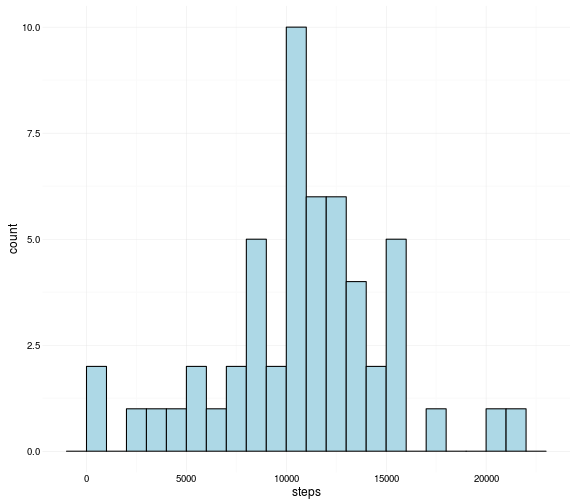
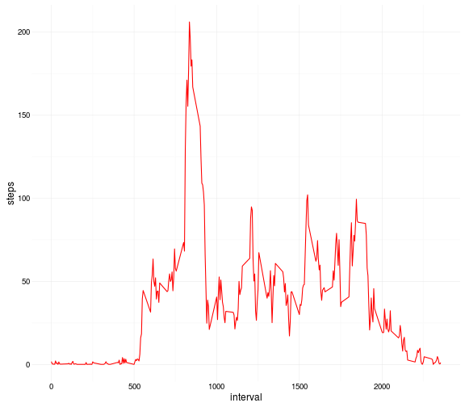
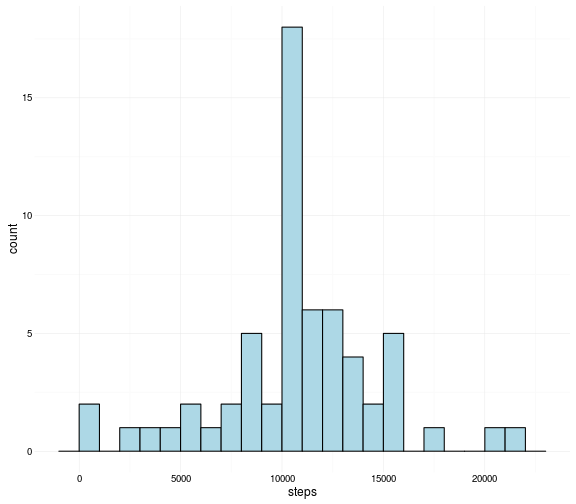
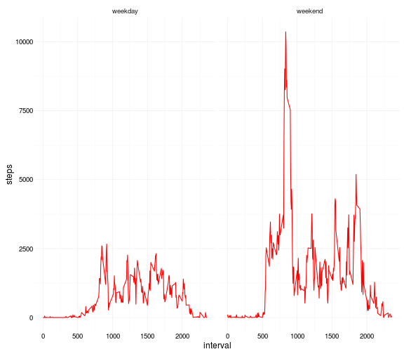

## Loading and preprocessing the data

Unzip the data and load it in the 'dat' dataset; the class of each column is explicity specified to have the Date in the right format from start.


```r
unzip('activity.zip')
df <- read.csv('activity.csv', colClasses = c('integer','Date','integer'))
```
Load some useful libraries

```r
library(dplyr)
library(ggplot2)
library(lubridate)
```
## What is mean total number of steps taken per day?

#### 1. Calculate the total number of steps taken per day

Using the dplyr library group the data by date and then summarise to find the mean of steps taken for each given day

```r
dfSum <- df %>%
  group_by(date) %>%
  summarise(steps = sum(steps))

dfSum
```

```
## Source: local data frame [61 x 2]
## 
##          date steps
##        (date) (int)
## 1  2012-10-01    NA
## 2  2012-10-02   126
## 3  2012-10-03 11352
## 4  2012-10-04 12116
## 5  2012-10-05 13294
## 6  2012-10-06 15420
## 7  2012-10-07 11015
## 8  2012-10-08    NA
## 9  2012-10-09 12811
## 10 2012-10-10  9900
## ..        ...   ...
```

#### 2. Make a histogram of the total number of steps taken each day

For each interval of number of steps (each whith a range of 1000 steps) plot the number of days it happened.

```r
p <- ggplot(data = dfSum, aes(x = steps))  + geom_histogram(fill = 'light blue', color =' black', binwidth = 1000) + theme_minimal()
p
```

```
## Warning: Removed 8 rows containing non-finite values (stat_bin).
```



#### 3. Calculate and report the mean and median of the total number of steps taken per day


```r
sumMean <- mean(dfSum$steps, na.rm = T)
sumMedian <- median(dfSum$steps, na.rm = T)

sumMean
```

```
## [1] 10766.19
```

```r
sumMedian
```

```
## [1] 10765
```

## What is the average daily activity pattern?

#### 1. Make a time series plot of the 5-minute interval (x-axis) and the average number of steps taken, averaged across all days (y-axis)

Create a dataframe containing the averages across all days for each interval then plot it

```r
dfInterval <- df %>%
  group_by(interval) %>%
  summarise(steps = mean(steps, na.rm = T))

p2 <- ggplot(data = dfInterval, aes(x = interval, y = steps)) + geom_line(color = 'red') + theme_minimal()
p2
```



#### 2. Which 5-minute interval, on average across all the days in the dataset, contains the maximum number of steps?


```r
maxInterval <- dfInterval[dfInterval$steps==max(dfInterval$steps),]

maxInterval
```

```
## Source: local data frame [1 x 2]
## 
##   interval    steps
##      (int)    (dbl)
## 1      835 206.1698
```

The interval with the maximum average number of steps is the number 835 that has 206.1698113 steps

## Imputing missing values

#### 1. Calculate and report the total number of missing values in the dataset (i.e. the total number of rows with NAs)


```r
naNumber <- df %>%
  filter(is.na(steps)) %>%
  summarise('number of Na\'s' = n())

naNumber
```

```
##   number of Na's
## 1           2304
```
#### 2. Devise a strategy for filling in all of the missing values in the dataset. The strategy does not need to be sophisticated. For example, you could use the mean/median for that day, or the mean for that 5-minute interval, etc.

To impute missing values I decided to use the average across all days for each interval. That means that if interval 5 has a NA its new values will be the average across all days of all intervals 5.

#### 3. Create a new dataset that is equal to the original dataset but with the missing data filled in.

```r
dfNew <- df %>%
  inner_join(dfInterval, by = 'interval') %>%
  transmute(date, interval, steps = ifelse(is.na(steps.x), steps.y, steps.x))
```

#### 4. Make a histogram of the total number of steps taken each day and Calculate and report the mean and median total number of steps taken per day. Do these values differ from the estimates from the first part of the assignment? What is the impact of imputing missing data on the estimates of the total daily number of steps?

```r
dfNewSum <- dfNew %>%
  group_by(date) %>%
  summarise(steps = sum(steps))
p3 <- ggplot(data = dfNewSum, aes(x = steps)) + geom_histogram(fill = 'light blue', color =' black', binwidth = 1000) + theme_minimal()
p3
```



```r
sumNewMean <- mean(dfNewSum$steps)
sumNewMedian <- median(dfNewSum$steps)

sumNewMean
```

```
## [1] 10766.19
```

```r
sumNewMedian
```

```
## [1] 10766.19
```

The mean does not change because the new values are means themselves thous have no impact on the totale average.
The median instead changes a bit because the observations has changed moving the median up.

## Are there differences in activity patterns between weekdays and weekends?


#### 1. Create a new factor variable in the dataset with two levels – “weekday” and “weekend” indicating whether a given date is a weekday or weekend day.


```r
dfNewDays <- dfNew %>%
  mutate(wday = ifelse(wday(date) %in% c(1,7), 'weekday','weekend')) %>%
  group_by(interval, wday) %>%
  summarize(steps = sum(steps))

p4 <- ggplot(data = dfNewDays,  aes(x = interval, y = steps)) + geom_line(color = 'red') + facet_grid(. ~ wday) + theme_minimal()
p4
```


